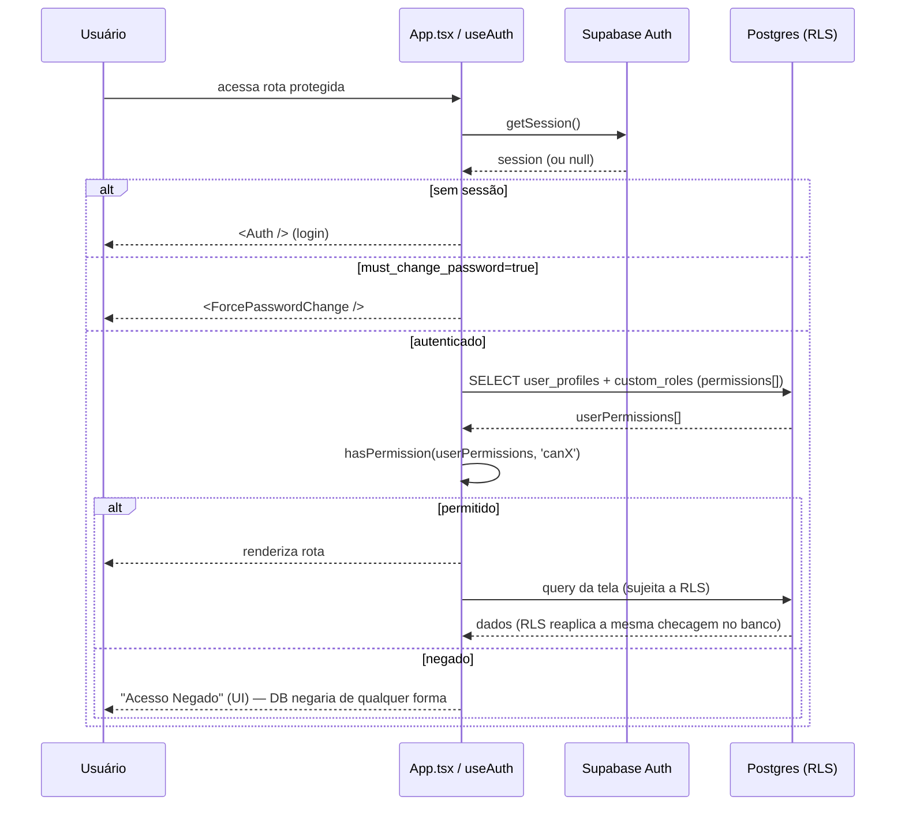

# Architecture — Flow LAB

> Última atualização: 2026-08-31

## Visão Geral

Flow LAB é um sistema web de gestão integrada para um laboratório de análises clínicas: inventário/estoque, requisições internas (compra, pagamento, manutenção, TI), cotações a fornecedores, faturamento a operadoras de saúde, contas a receber, agendamento e execução de análises clínicas (coletas, culturas, laudos), um módulo de qualidade (ocorrências, cortesias, IHQ, registro de câncer) e um kanban multi-departamento. A interface é inteiramente em português (pt-BR).

É uma SPA React servida por uma API serverless (Vercel Functions) com Supabase como backend (Postgres + Auth + Storage + RLS). Além do deploy padrão na Vercel, o mesmo código de API roda também como servidor Node standalone em Docker/VPS — usado quando é preciso um endpoint estável, alcançável por túnel ngrok, para webhooks de integrações externas (LIS externo "LabHub", laboratório de apoio "Alvaro/AOL", sistema faturador "APLIS").

O sistema nasceu como um controle de inventário ("inventory-system", nome ainda no `package.json`) e cresceu por acréscimo de módulos de domínio (bounded contexts) conforme o laboratório precisou digitalizar novos processos — por isso convivem, hoje, um núcleo antigo não-modularizado (`src/components/`) e módulos novos autocontidos (`src/modules/`).

O modelo de dados é **single-tenant**: as 81 tabelas do schema não têm `tenant_id`/`company_id`/`organization_id` — o isolamento de dados é só por usuário/departamento/cargo via RLS, assumindo uma única empresa operando o sistema.

## Stack Tecnológica

| Categoria           | Tecnologia              | Versão   | Observação |
|----------------------|--------------------------|----------|------------|
| Linguagem            | TypeScript               | ~5.6     | `strict: false` |
| Framework UI         | React                    | 18.3     | |
| Build tool           | Vite                     | 5.4      | dev server + middlewares custom para simular rotas de API |
| Estilização          | TailwindCSS              | 3.4      | Design system próprio (`docs/DESIGN_SYSTEM_FLOWLAB.md`) |
| Roteamento           | React Router             | 6.28     | SPA, `future` flags v7 habilitadas |
| Data fetching/estado | @tanstack/react-query    | 5.101    | + cache context próprio (`useDataCache`) |
| Animações            | Framer Motion            | 12.x     | |
| Dashboard            | react-grid-layout, recharts | 2.x / 3.7 | Widgets drag-and-drop |
| Fluxos/mapas         | @xyflow/react, @dnd-kit  | 12.x / 6.x | Mind map de projetos de TI, kanban |
| Backend (BaaS)       | Supabase                 | JS SDK ^2.39 | Postgres + Auth + Storage + Realtime + RLS |
| API                  | Vercel Functions         | @vercel/node ^5.1 | Handlers `Request`/`Response`-like em `api/` |
| Server standalone    | Node `http` puro         | Node 22  | `api/server.ts`, usado no deploy Docker |
| IA                   | @google/genai (Gemini)   | ^1.16    | OCR/estruturação de documentos do laboratório de apoio |
| PDF                  | jspdf, jspdf-autotable    | 3.x      | Geração de laudos/relatórios |
| Planilhas            | xlsx                     | 0.18     | Import/export |
| E-mail               | nodemailer                | 8.x      | SMTP |
| Testes               | vitest                    | 3.2      | |
| Worker externo       | Node + express + node-cron | —      | `workers/billing-sync/` — processo separado, fora do app Vercel |
| Deploy               | Vercel (padrão) / Docker+ngrok (VPS) | — | `vercel.json`, `Dockerfile`, `docker-compose.yml` |

## Estrutura de Diretórios

```
flowlab/
├── src/                        # Frontend (SPA)
│   ├── App.tsx                 # Rotas + ProtectedRoute (checagem de permissão por rota)
│   ├── main.tsx                # Entry point
│   ├── components/             # Núcleo legado: inventário, requisições, usuários, TI — não modularizado
│   │   ├── IT/                 # Módulo de TI (kanban, projetos, mind map) — ainda em components/, não em modules/
│   │   ├── MaintenanceRequest/ # Requisições de manutenção
│   │   └── CostControl/        # Controle de custos/exames (billing)
│   ├── modules/                 # Bounded contexts autocontidos (tipos+hooks+componentes+domain próprios)
│   │   ├── quotations/         # Cotações a fornecedores — state machine de workflow
│   │   ├── messaging/          # Mensageria (WhatsApp via WAHA) — service + provider pattern
│   │   ├── faturamento/        # Faturamento a operadoras + contas a receber
│   │   ├── analises-clinicas/  # Agendamento, coletas, culturas, laudos, integração LabHub/Alvaro
│   │   ├── qualidade/          # Ocorrências, cortesias, IHQ, registro de câncer (portado de outro projeto)
│   │   └── board/               # Kanban multi-departamento (acesso via custom_roles.board_id)
│   ├── hooks/                   # Hooks compartilhados (useAuth, useInventory, useDataCache, ...)
│   ├── contexts/                # AuthContext
│   ├── lib/                     # Cliente Supabase + types gerados do DB
│   ├── types/                   # Tipos globais da aplicação
│   └── utils/                   # permissions.ts (RBAC), formatação, cpf, etc.
│
├── api/                         # API — handlers compartilhados entre Vercel e o server standalone
│   ├── server.ts                # Servidor HTTP puro p/ Docker: serve dist/ + roteia para os mesmos handlers
│   ├── _lib/
│   │   ├── handlers/            # Um handler por operação (dispatcher pattern)
│   │   ├── apoio/               # Integração com laboratório de apoio "Alvaro" (AOL) + pipeline de IA (Gemini)
│   │   ├── faturamento/         # Regras de autorização e acesso a dados de faturamento
│   │   ├── qualidade/           # Regras de negócio do módulo Qualidade
│   │   ├── labhubIntegration.ts # Integração com o LIS externo LabHub
│   │   ├── email.ts             # Envio via SMTP
│   │   └── supabase.ts          # Cliente Supabase server-side (service role)
│   ├── analises-clinicas/[action].ts  # Dispatcher Vercel (query string `action`)
│   ├── faturamento/[action].ts        # idem
│   └── qualidade/[action].ts          # idem
│
├── workers/billing-sync/        # Processo Node separado: sincroniza faturamento com o ERP "APLIS" (cron)
│
├── supabase/
│   ├── migrations/               # ~280 migrações SQL, schema + RLS (sem isolamento multi-tenant)
│   └── scripts/                  # Scripts avulsos de produção/correção
│
├── docs/                         # Documentação (arquitetura anterior, design system, planos por módulo, ADRs informais)
├── .claude/, .scratch/            # Ferramentas de agente (skills, issue tracker local)
├── vercel.json                   # Rewrites SPA + cron (umami inatividade)
├── docker-compose.yml            # api + túnel ngrok, para deploy manual em VPS
└── Dockerfile                    # Build multi-stage: frontend (dist/) + API compilada
```

## Arquitetura do Sistema

```mermaid
flowchart TB
    subgraph Client["Cliente"]
        SPA["React SPA (Vite)<br/>src/App.tsx"]
    end

    subgraph Deploy["Camada de API (mesmo código, dois runtimes)"]
        Vercel["Vercel Functions<br/>api/*/[action].ts"]
        DockerAPI["Server Node standalone<br/>api/server.ts (Docker/VPS)"]
    end

    subgraph Supabase["Supabase (BaaS)"]
        PG[(PostgreSQL<br/>81 tabelas + RLS)]
        Auth["Supabase Auth"]
        Storage["Supabase Storage<br/>anexos, PDFs, imagens"]
        Realtime["Realtime<br/>chat, comentários"]
    end

    subgraph External["Integrações externas"]
        WAHA["WAHA<br/>WhatsApp HTTP API"]
        LabHub["LabHub<br/>LIS externo (webhooks)"]
        Alvaro["Alvaro / AOL<br/>laboratório de apoio"]
        Gemini["Google Gemini<br/>OCR/estruturação de documentos"]
        APLIS["APLIS<br/>ERP de faturamento"]
        SMTP["SMTP<br/>e-mails transacionais"]
        Umami["Umami<br/>analytics"]
    end

    subgraph Worker["Processo separado"]
        BillingSync["billing-sync worker<br/>Node + node-cron"]
    end

    SPA -->|fetch| Vercel
    SPA -->|fetch (deploy VPS)| DockerAPI
    SPA -->|supabase-js| Auth
    SPA -->|supabase-js| PG
    SPA -->|supabase-js| Storage
    SPA -->|supabase-js| Realtime

    Vercel --> PG
    Vercel --> Storage
    Vercel --> WAHA
    Vercel --> LabHub
    Vercel --> Alvaro
    Vercel --> Gemini
    Vercel --> SMTP

    DockerAPI --> PG
    DockerAPI --> LabHub
    DockerAPI --> Alvaro

    BillingSync -->|cron| APLIS
    BillingSync --> PG

    Vercel -.cron semanal.-> Umami
```

A aplicação segue um modelo **BaaS + serverless**: o frontend fala diretamente com o Supabase (Auth, queries, Storage, Realtime) na maior parte dos casos, e só passa pela camada `api/` quando a operação exige uma credencial privilegiada (service role), lógica que não pode rodar no cliente, ou integração com um sistema externo. RLS no Postgres é a linha de defesa primária — mesmo tendo `hasPermission()` no frontend, o acesso real é decidido pelas policies (`current_user_has_permission()`).

## Fluxo de Dados

### Autenticação e autorização (fluxo central da aplicação)



O `hasPermission()` no frontend é só uma otimização de UX (evita renderizar e disparar queries que o banco vai rejeitar). A autorização real vive nas RLS policies, que chamam `current_user_has_permission()` no Postgres — olhando `custom_roles.permissions` do usuário, ou `role = 'admin'`. Um perfil sem `custom_role_id` fica **sem nenhuma permissão** no banco, mesmo que o fallback de role legada no frontend sugira o contrário (ver comentário em `src/utils/permissions.ts`).

### Integração externa representativa (Análises Clínicas ↔ LabHub)

Fluxo assíncrono via webhook: o LIS externo (LabHub) envia agendamentos/cancelamentos para `api/_lib/handlers/receive-agendamento.ts` / `receive-cancelamento.ts`; o Flow LAB processa a coleta, e ao concluir uma etapa (ex.: laudo), notifica de volta o LabHub (`fase7_notificar_labhub_coleta`). Documentos do paciente e do laboratório de apoio (Alvaro) passam por um pipeline com IA (`api/_lib/apoio/pipeline.ts` + `gemini.ts`) para extração/estruturação antes de entrar no fluxo de faturamento/laudo.

## Módulos e Responsabilidades

| Módulo | Local | Responsabilidade | Não faz |
|---|---|---|---|
| **Inventário** | `src/components/` (legado) | Produtos, estoque por local (multi-local desde a Fase 5), movimentações, validade | Não trata faturamento nem análises |
| **Requisições** (SC/SM, pagamento, manutenção) | `src/components/` (legado) | Fluxo de aprovação de compras/serviços/pagamentos internos | Não é o módulo de cotação a fornecedores (esse é separado) |
| **Quotations** (cotações) | `src/modules/quotations/` | Cotação a fornecedores com máquina de estados, propostas, aprovação, PDF | Não movimenta estoque diretamente — conversão em pedido é um evento separado |
| **Messaging** | `src/modules/messaging/` | Abstração de canal de mensagem (`IMessagingProvider`) + implementação WhatsApp (WAHA) | Não define o conteúdo de negócio da mensagem, só entrega |
| **Faturamento** | `src/modules/faturamento/` + `api/faturamento/` + `workers/billing-sync/` | Emissão de títulos/notas para operadoras de saúde, contas a receber, glosas/recursos, sincronização com APLIS | Não faz agendamento nem coleta (consome dados de Análises Clínicas) |
| **Análises Clínicas** | `src/modules/analises-clinicas/` | Agendamento, postos, coletas, culturas, temperatura, laudos, integração LabHub/Alvaro | Não decide faturamento — só gera os eventos que o faturamento consome |
| **Qualidade** | `src/modules/qualidade/` | Ocorrências, cortesias, IHQ, registro de câncer — portado de um projeto irmão (`flowlab-qualidade`) | Depende de heurísticas best-effort para identificar dados no LIS legado (ver `bdLabQualidade.ts`) |
| **Board** | `src/modules/board/` | Kanban multi-departamento; acesso via `custom_roles.board_id`, não via permission string | Não usa `<ProtectedRoute>` — o gate é interno ao componente |
| **IT** | `src/components/IT/` | Kanban de TI, projetos, mind map, SLA | Ainda não migrado para `src/modules/` |
| **Usuários/Auth** | `src/hooks/useAuth.ts`, `src/utils/permissions.ts` | Sessão, perfil, RBAC dual (role legada + custom_roles) | — |

## Integrações Externas

| Serviço | Propósito | Onde |
|---|---|---|
| **Supabase** | Postgres, Auth, Storage, Realtime, RLS | Todo o app |
| **WAHA** | Envio de WhatsApp para fornecedores (cotações) | `src/modules/messaging/providers/WAHAProvider.ts` |
| **LabHub** | LIS externo — agendamentos, cancelamentos, resultados via webhook | `api/_lib/labhubIntegration.ts`, `api/_lib/handlers/receive-*` |
| **Alvaro / AOL** | Laboratório de apoio (exames terceirizados) — webservice SOAP/XML | `api/_lib/apoio/aol.ts`, `xmlAol.ts`, doc em `docs/apoio-alvaro/` |
| **Google Gemini** | OCR/estruturação de documentos recebidos do laboratório de apoio | `api/_lib/apoio/gemini.ts`, `promptGemini.ts` |
| **APLIS** | ERP de faturamento — sincronização de operadoras/lotes | `workers/billing-sync/`, `api/_lib/apoio/aplis.ts` |
| **SMTP** | E-mails transacionais (notificações, aprovações) | `api/_lib/email.ts`, `nodemailer` |
| **Umami** | Analytics self-hosted | `api/umami/[action].ts`, cron semanal (`vercel.json`) |

## Decisões Arquiteturais

### Dois runtimes para a mesma API
- **Contexto observado**: parte das integrações (LabHub, Alvaro) precisa de um endpoint webhook estável e alcançável por fora; a Vercel é o deploy padrão, mas o projeto também roda em VPS via Docker + túnel ngrok.
- **Decisão**: os handlers de API são escritos contra uma interface `Request`/`Response`-like (padrão Vercel) e reaproveitados por dois entry points — `api/*/[action].ts` (Vercel) e `api/server.ts` (servidor Node puro, com wrappers `wrapRequest`/`wrapResponse`).
- **Consequência**: a lógica de negócio não duplica, mas o roteamento duplica (dispatcher por `action` na Vercel vs. `Map` de rotas fixas no server standalone) — toda rota nova precisa ser registrada nos dois lugares quando é usada pelo deploy Docker.

### RBAC dual: role legada + `custom_roles` dinâmico
- **Contexto observado**: o sistema começou com 3 roles fixas (`admin`/`operator`/`requester`); o crescimento para múltiplos departamentos e módulos exigiu permissões granulares (`ALL_PERMISSION_KEYS`) sem quebrar usuários já cadastrados só com role legada.
- **Decisão**: tabela `custom_roles` com array de permissões, referenciada por `user_profiles.custom_role_id`; a função `current_user_has_permission()` no Postgres só reconhece `custom_roles.permissions` ou `role = 'admin'` — o fallback de permissões por role legada existe apenas no frontend.
- **Consequência**: um usuário `operator`/`requester` sem `custom_role_id` atribuído fica com zero permissões reais no RLS, mesmo que a UI (usando o fallback) sugira acesso — fonte recorrente de bugs de "botão que dá 403" (ver comentário em `permissions.ts`, issue 04 referenciada no código).

### Módulos novos isolados, núcleo antigo não migrado
- **Contexto observado**: `src/modules/` (quotations, messaging, faturamento, analises-clinicas, qualidade, board) segue um padrão consistente — `types/`, `domain/`, `hooks/`, `components/`, `index.ts` como fachada. `src/components/` concentra os domínios mais antigos (inventário, requisições, usuários, TI) sem essa estrutura.
- **Decisão implícita**: todo domínio novo entra como módulo autocontido (há inclusive uma skill `add-module` para isso); os domínios legados não foram retroativamente migrados.
- **Consequência**: duas convenções convivem no mesmo repositório; um dev (ou agente) precisa saber qual domínio é "módulo" e qual é "legado" antes de decidir onde colocar código novo.

### Worker de sincronização fora do processo principal
- **Contexto observado**: a sincronização de faturamento com o ERP externo (APLIS) roda em `workers/billing-sync/`, um processo Node+Express+node-cron com `package.json` próprio, separado do app Vercel — apesar de o projeto já ter um mecanismo de cron nativo da Vercel (usado para o alerta de inatividade do Umami em `vercel.json`).
- **Consequência**: a sincronização com APLIS tem seu próprio ciclo de deploy/operação, independente do frontend/API principal.

### Modelo de dados single-tenant
- **Contexto observado**: nenhuma das 81 tabelas do schema tem `tenant_id`, `company_id` ou equivalente; RLS isola por usuário/departamento/cargo, não por organização.
- **Consequência**: o sistema, como está, atende uma única empresa por instalação/banco. Qualquer generalização para múltiplas empresas (multi-tenant) exigiria introduzir essa dimensão de isolamento em todas as tabelas e policies, e revisar toda lógica que hoje assume "uma empresa só" (departamentos fixos, cargos, catálogos como `ac_tipos_frasco`, `qa_motivos_ocorrencia`, etc., que são dados globais e não por tenant).

## Configuração e Variáveis de Ambiente

| Grupo | Variáveis |
|---|---|
| Supabase | `VITE_SUPABASE_URL`, `VITE_SUPABASE_ANON_KEY`, `SUPABASE_URL`, `SUPABASE_SERVICE_ROLE_KEY` |
| Banco direto (worker) | `DB_HOST`, `DB_PORT`, `DB_NAME`, `DB_USER`, `DB_PASSWORD` |
| E-mail | `SMTP_HOST`, `SMTP_PORT`, `SMTP_USER`, `SMTP_PASS`, `SMTP_FROM`, `PURCHASE_ALERT_TO`, `INACTIVITY_ALERT_TO` |
| WhatsApp / Mensageria | (config por `messaging_providers` no banco; WAHA URL/token) |
| Laboratório de apoio (Alvaro/AOL) | `AOL_CHAVE`, `AOL_ENTIDADE`, `AOL_IDAGENTE`, `AOL_SENHA` |
| LabHub | `LABHUB_API_URL`, `LABHUB_WEBHOOK_SECRET`, `FLOWLAB_API_KEY` |
| APLIS (ERP faturamento) | `APLIS_BASE_URL`, `APLIS_USUARIO`, `APLIS_SENHA` |
| IA | `GEMINI_API_KEY` |
| Analytics | `UMAMI_BASE_URL`, `UMAMI_USER`, `UMAMI_PASS`, `UMAMI_TIMEZONE`, `VITE_UMAMI_TRACKER_SRC`, `VITE_UMAMI_WEBSITE_ID` |
| Diversos | `VITE_APP_URL`, `CRON_SECRET`, `SLACK_INVITE_URL` |

## Como Rodar Localmente

```bash
npm install
cp .env.example .env   # preencher credenciais Supabase (mínimo)
npm run dev             # Vite dev server (frontend + middlewares simulando parte da API)
npm run dev:api          # alternativa: Vercel dev, para exercitar as rotas serverless completas
npm run test              # vitest
```

Deploy Docker/VPS (alternativo, ver `docker-compose.yml`):
```bash
docker compose up -d --build
```

## Roadmap Arquitetural

- [ ] Migrar os domínios legados de `src/components/` (inventário, requisições, TI, usuários) para o padrão de módulo em `src/modules/`
- [ ] Unificar o registro de rotas entre o dispatcher Vercel e o `Map` de rotas do `api/server.ts` para evitar duplicação manual
- [ ] Regenerar `src/lib/database.types.ts` (hoje bem menor que o número real de tabelas do schema) a partir do schema atual
- [ ] Avaliar introdução de uma dimensão de tenant/organização no schema, caso o produto precise atender mais de uma empresa
