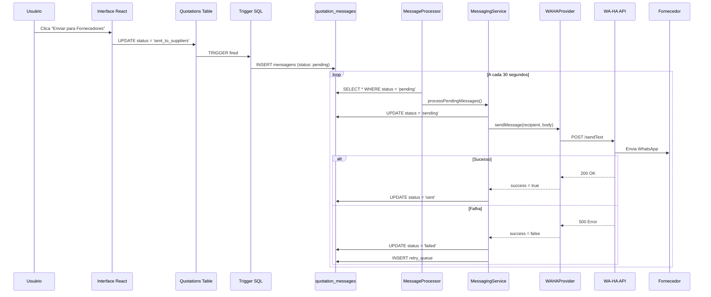
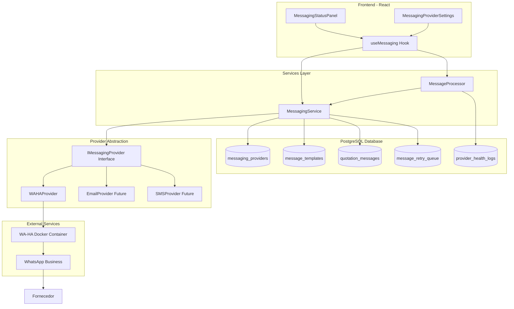
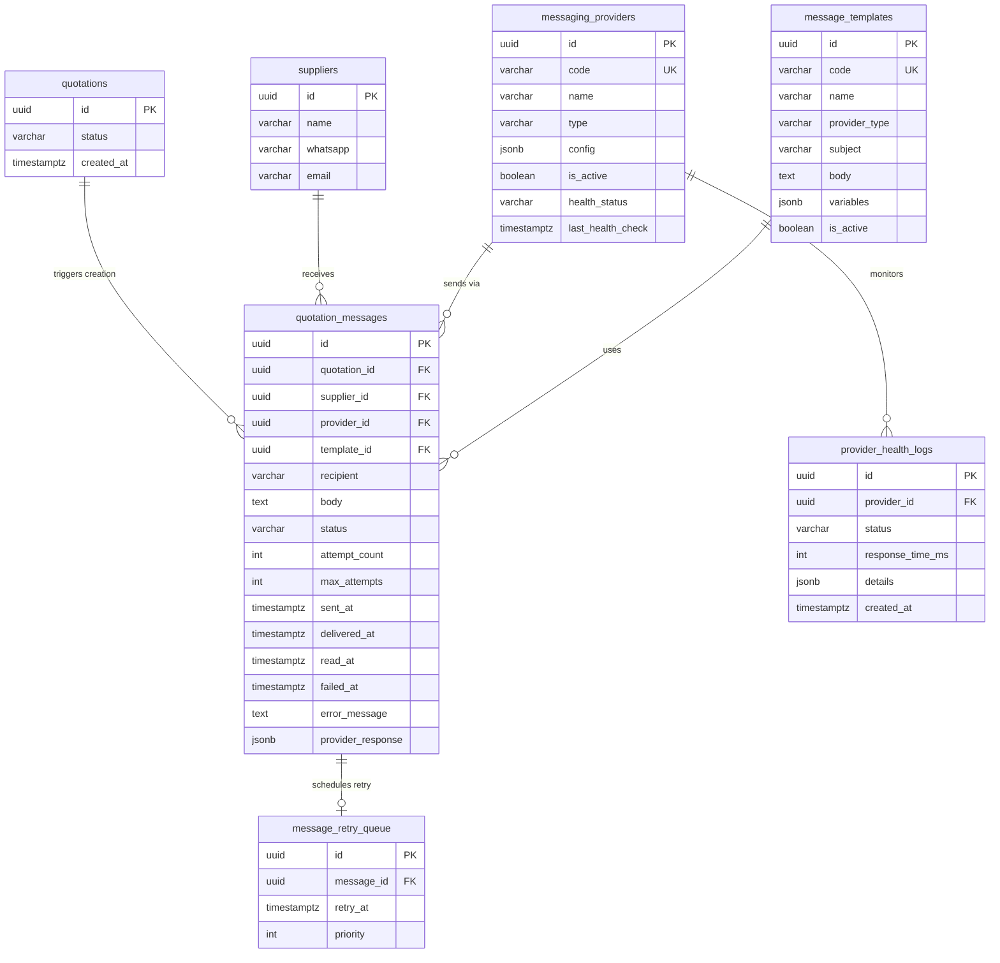
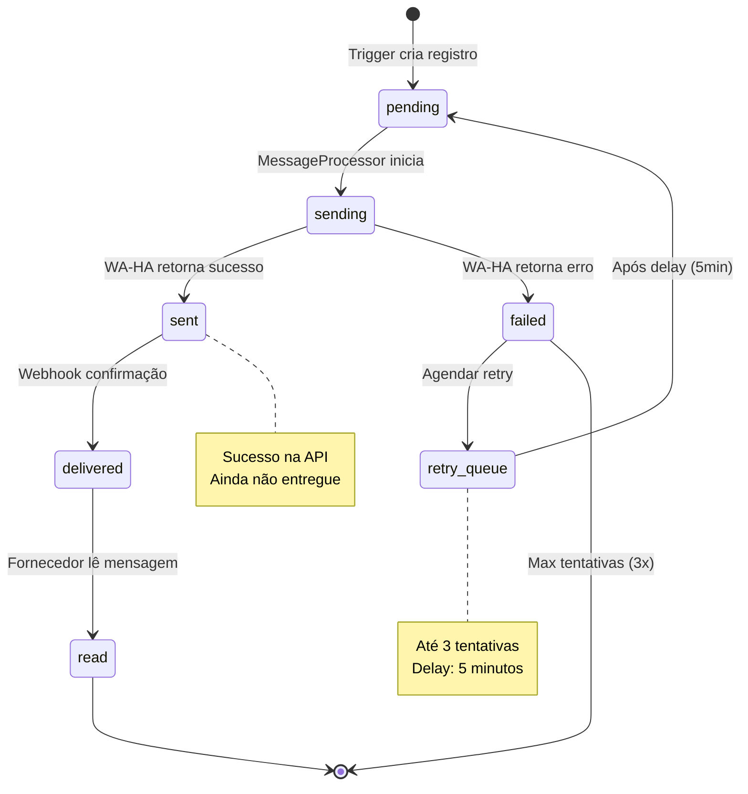
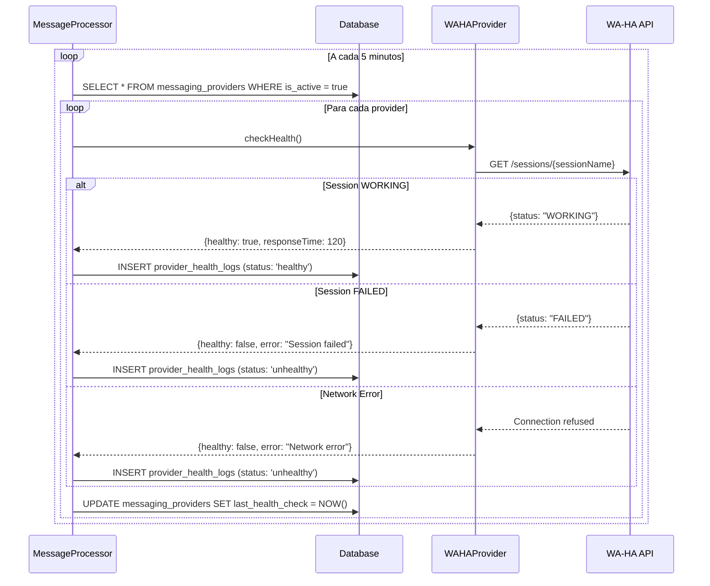
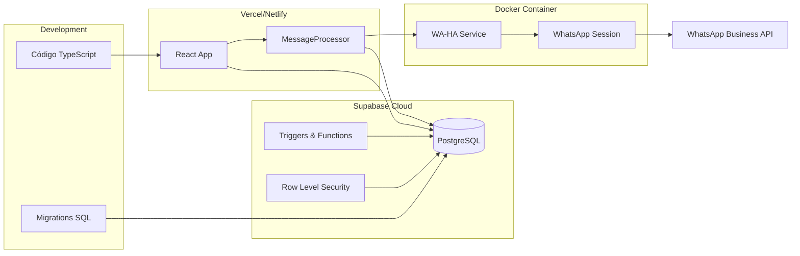
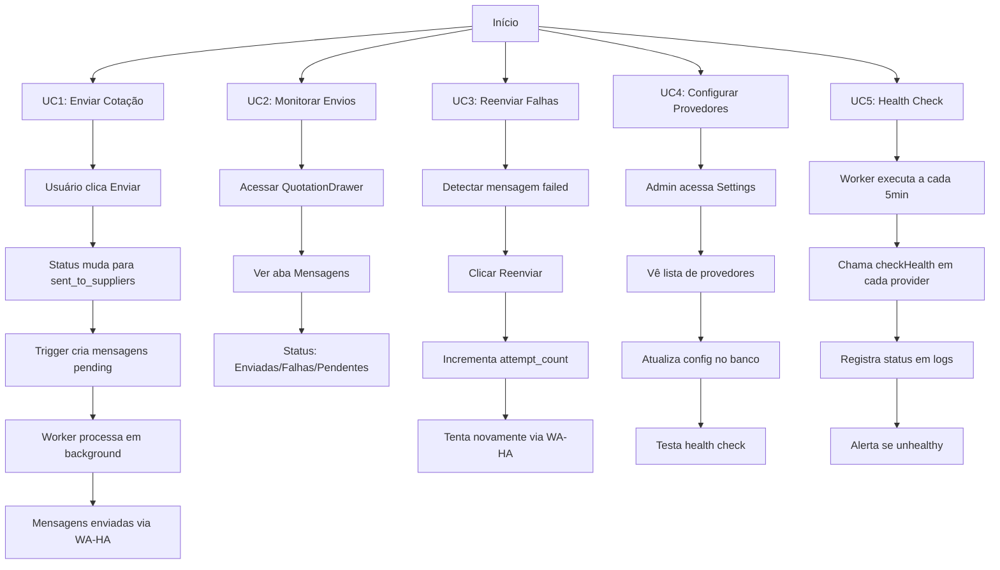

# Arquitetura do Sistema de Mensageria - Diagramas

## Fluxo de Envio de Mensagens

## Arquitetura de Componentes

## Modelo de Dados

## Estados e Transições de Mensagens

## Fluxo de Health Check

## Deploy e Configuração

## Casos de Uso

