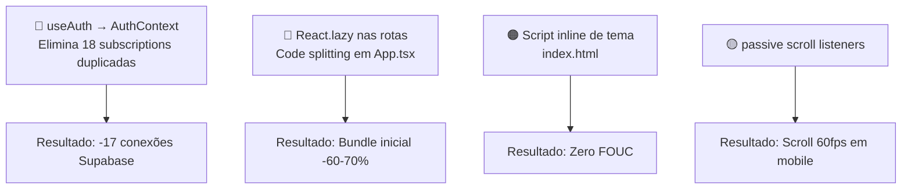

# Análise Vercel React Best Practices — FlowLab

> Análise realizada em 25/05/2026.
> Base de código: React 18.3 + TypeScript 5.6 + Vite + Tailwind + Supabase.
> Referência de regras: [Vercel React Best Practices SKILL](../.agents/skills/vercel-react-best-practices/SKILL.md)

---

## Sumário Executivo

| Categoria   | Regra                            | Severidade     | Status                                              |
| ----------- | -------------------------------- | -------------- | --------------------------------------------------- |
| Bundle Size | `bundle-dynamic-imports`         | 🔴 CRITICAL    | Violação em `App.tsx`                               |
| Bundle Size | `bundle-barrel-imports`          | 🔴 CRITICAL    | Violação em `modules/quotations`                    |
| Client-Side | `client-event-listeners`         | 🔴 CRITICAL    | `useAuth` sem Context — 18 subscriptions duplicadas |
| Rendering   | `rendering-hydration-no-flicker` | 🟠 HIGH        | Flash de tema no carregamento                       |
| Client-Side | `client-passive-event-listeners` | 🟡 MEDIUM-HIGH | Scroll listeners bloqueantes                        |
| Re-render   | `rerender-split-combined-hooks`  | 🟡 MEDIUM      | `useInventory` monolítico                           |
| JavaScript  | `js-combine-iterations`          | 🟢 MEDIUM      | `.map().filter()` em `useBilling`                   |
| Re-render   | `rerender-lazy-state-init`       | 🟢 MEDIUM      | `useState` com objetos literais                     |
| JavaScript  | `js-cache-storage`               | 🔵 LOW-MEDIUM  | `localStorage` sem cache                            |

---

## 1. 🔴 CRITICAL — `bundle-dynamic-imports`

**Regra:** Use `React.lazy()` para componentes pesados por rota, evitando que todo o código seja empacotado em um único bundle.

### Problema

Em [src/App.tsx](../src/App.tsx), **todos os 25+ componentes de rota são importados estaticamente** no topo do arquivo:

```tsx
// App.tsx — todas as importações são estáticas, sem code splitting
import Dashboard from "./components/Dashboard";
import ProductList from "./components/ProductList";
import RequestManagement from "./components/RequestManagement";
import { QuotationManagementPage } from "./modules/quotations";
import {
  FaturasDashboard,
  RecebimentosList,
  GlosasRecursos,
} from "./modules/faturamento";
import ITKanbanBoard from "./components/IT/ITKanbanBoard";
import ITProjectMindMap from "./pages/IT/ITProjectMindMap";
// ... + 18 outros imports
```

Isso faz com que **todo o JavaScript da aplicação** — incluindo `recharts`, `@xyflow/react`, `jspdf`, `react-signature-canvas`, `@hello-pangea/dnd` e `framer-motion` — seja baixado pelo usuário na primeira carga, mesmo que ele nunca acesse a maioria das rotas.

### Solução

```tsx
// App.tsx — com lazy loading por rota
import React, { lazy, Suspense } from "react";
import { PageLoadingSkeleton } from "./components/PageLoadingSkeleton";

const Dashboard = lazy(() => import("./components/Dashboard"));
const ProductList = lazy(() => import("./components/ProductList"));
const QuotationManagementPage = lazy(() =>
  import("./modules/quotations").then((m) => ({
    default: m.QuotationManagementPage,
  })),
);
const ITKanbanBoard = lazy(() => import("./components/IT/ITKanbanBoard"));
const ITProjectMindMap = lazy(() => import("./pages/IT/ITProjectMindMap"));
// ... demais rotas

// No JSX:
<Suspense fallback={<PageLoadingSkeleton />}>
  <Routes>
    <Route path="/dashboard" element={<Dashboard />} />
    {/* ... */}
  </Routes>
</Suspense>;
```

**Impacto estimado:** Redução drástica do bundle inicial — apenas `Layout`, `Auth` e `Home` precisam ser carregados na primeira visita.

---

## 2. 🔴 CRITICAL — `bundle-barrel-imports`

**Regra:** Evite re-exportações em barril (`export * from ...`). Elas impedem o tree-shaking e forçam o bundler a incluir tudo do módulo no bundle.

### Problema

O módulo de cotações em [src/modules/quotations/index.ts](../src/modules/quotations/index.ts) reexporta tudo:

```ts
export * from "./types"; // todos os tipos
export * from "./workflow"; // máquina de estados completa
export * from "./hooks"; // todos os hooks
export * from "./components"; // todos os componentes
```

E em [src/App.tsx](../src/App.tsx) o consumo via named import:

```tsx
import { QuotationManagementPage } from "./modules/quotations";
```

Essa forma de importar faz com que o Vite/Rollup precise processar todo o grafo de dependências do módulo `quotations` — incluindo componentes que não são usados nessa rota — antes de poder efetuar tree-shaking.

### Solução

```tsx
// App.tsx — importar diretamente do arquivo fonte
import { QuotationManagementPage } from "./modules/quotations/components/QuotationManagementPage";
```

Se o barrel for mantido por conveniência de API pública do módulo, assegurar que cada arquivo fonte use `export default` + named re-exports explícitos (não `export *`) para permitir análise estática precisa.

---

## 3. 🔴 CRITICAL — `client-event-listeners`

**Regra:** Deduplique ouvintes de eventos globais. Múltiplas instâncias do mesmo listener desperdiçam memória e processamento.

### Problema

O hook [src/hooks/useAuth.ts](../src/hooks/useAuth.ts) **não usa Context**. Cada componente que chama `useAuth()` cria seu próprio estado independente E sua própria subscription ao Supabase Auth:

```ts
// useAuth.ts — cada chamada cria uma nova subscription
useEffect(() => {
  supabase.auth.getSession().then(...)

  const { data: { subscription } } = supabase.auth.onAuthStateChange((_event, session) => {
    setSession(session);
    setUser(session?.user ?? null);
    // ...
  });

  return () => subscription.unsubscribe();
}, []);
```

`useAuth()` é chamado em **18 locais diferentes** do projeto simultaneamente (quando o usuário está autenticado):

| Componente                     | Arquivo                                    |
| ------------------------------ | ------------------------------------------ |
| `AuthenticatedApp`             | `App.tsx`                                  |
| `Layout`                       | `Layout.tsx`                               |
| `NotificationBell`             | `NotificationBell.tsx`                     |
| `Home`                         | `Home.tsx`                                 |
| `RequestManagement`            | `RequestManagement.tsx`                    |
| `PaymentRequestManagement`     | `PaymentRequestManagement.tsx`             |
| `RequestHub`                   | `RequestHub.tsx`                           |
| `UserManagement`               | `UserManagement.tsx`                       |
| `NotificationAdminPanel`       | `NotificationAdminPanel.tsx`               |
| `RequestPeriodConfig`          | `RequestPeriodConfig.tsx`                  |
| `Auth` (standalone)            | `auth-standalone/Auth.tsx`                 |
| `Auth` (main)                  | `components/Auth.tsx`                      |
| `ITRequestManagement`          | `IT/ITRequestManagement.tsx`               |
| `ITKanbanBoard`                | `IT/ITKanbanBoard.tsx`                     |
| `ITTaskDrawer`                 | `IT/ITTaskDrawer.tsx`                      |
| `ITProjectMindMap`             | `pages/IT/ITProjectMindMap.tsx`            |
| `MaintenanceRequestManagement` | `MaintenanceRequest/...`                   |
| `useQuotation`                 | `modules/quotations/hooks/useQuotation.ts` |

Isso resulta em **até 18 conexões WebSocket simultâneas** com o Supabase Auth Realtime, 18 `getSession()` calls e 18 estados de usuário independentes que precisam ser sincronizados.

### Solução

Converter `useAuth` em Provider + Context:

```tsx
// hooks/useAuth.tsx
const AuthContext = createContext<AuthContextType | null>(null);

export function AuthProvider({ children }: { children: ReactNode }) {
  const [user, setUser] = useState<User | null>(null);
  const [userProfile, setUserProfile] = useState<UserProfile | null>(null);
  const [loading, setLoading] = useState(true);

  useEffect(() => {
    // Apenas UMA subscription para toda a aplicação
    supabase.auth.getSession().then(({ data: { session } }) => { ... });

    const { data: { subscription } } = supabase.auth.onAuthStateChange(...);
    return () => subscription.unsubscribe();
  }, []);

  return <AuthContext.Provider value={{ user, userProfile, loading, ... }}>{children}</AuthContext.Provider>;
}

export function useAuth() {
  const ctx = useContext(AuthContext);
  if (!ctx) throw new Error('useAuth must be used within AuthProvider');
  return ctx;
}
```

```tsx
// main.tsx
createRoot(document.getElementById("root")!).render(
  <ThemeProvider>
    <AuthProvider>
      {" "}
      {/* ← adicionar aqui */}
      <App />
    </AuthProvider>
  </ThemeProvider>,
);
```

**Impacto:** Redução de 18 subscriptions para 1, eliminando race conditions entre estados de auth e reduzindo uso de memória e conexões ao Supabase.

---

## 4. 🟠 HIGH — `rendering-hydration-no-flicker`

**Regra:** Use um script inline no `<head>` para dados que dependem do cliente (ex: tema) antes do React montar, evitando flash de conteúdo incorreto.

### Problema

O [index.html](../index.html) não tem nenhum script inline. O hook [src/hooks/useTheme.tsx](../src/hooks/useTheme.tsx) lê o localStorage e aplica a classe `dark` somente no `useEffect`, que roda **após** o primeiro render:

```html
<!-- index.html — sem script de tema -->
<head>
  <meta charset="UTF-8" />
  <!-- ... -->
</head>
```

```tsx
// useTheme.tsx — tema aplicado via useEffect (tarde demais)
useEffect(() => {
  if (themePreference === "system") {
    applyTheme(getSystemTheme());
  } else {
    applyTheme(themePreference);
  }
}, [themePreference, applyTheme]);
```

Usuários com `dark` salvo no localStorage veem um flash do tema claro ao carregar a página.

### Solução

```html
<!-- index.html — adicionar antes de </head> -->
<script>
  (function () {
    try {
      var pref = localStorage.getItem("flowlab-theme-preference");
      var dark =
        pref === "dark" ||
        ((!pref || pref === "system") &&
          window.matchMedia("(prefers-color-scheme: dark)").matches);
      if (dark) document.documentElement.classList.add("dark");
    } catch (e) {}
  })();
</script>
```

**Impacto:** Elimina o flash de tema (FOUC) para 100% dos usuários com preferência salva.

---

## 5. 🟡 MEDIUM-HIGH — `client-passive-event-listeners`

**Regra:** Use `{ passive: true }` em `scroll` e `touchstart` event listeners para não bloquear o compositor do navegador e manter 60fps.

### Problema

Dois componentes registram scroll listeners sem a flag `passive`:

**[src/components/CollapsedFlyoutMenu.tsx](../src/components/CollapsedFlyoutMenu.tsx)** (linha ~75):

```ts
window.addEventListener("scroll", recalc, true); // ← sem passive
window.addEventListener("resize", recalc);
```

**[src/components/NotificationBell.tsx](../src/components/NotificationBell.tsx)** (linha ~220):

```ts
window.addEventListener("scroll", reposition, true); // ← sem passive
window.addEventListener("resize", reposition);
```

Listeners de scroll sem `passive: true` fazem o browser esperar o listener completar antes de atualizar o scroll, causando jank visível especialmente em dispositivos móveis.

### Solução

```ts
// CollapsedFlyoutMenu.tsx
window.addEventListener("scroll", recalc, { passive: true, capture: true });
window.addEventListener("resize", recalc, { passive: true });

// NotificationBell.tsx
window.addEventListener("scroll", reposition, { passive: true, capture: true });
window.addEventListener("resize", reposition, { passive: true });

// Cleanup correspondente:
window.removeEventListener("scroll", recalc, { capture: true });
window.removeEventListener("resize", recalc);
```

> **Nota:** O terceiro argumento `true` (capture mode) e `{ passive: true }` podem ser combinados usando o formato de objeto.

---

## 6. 🟡 MEDIUM — `rerender-split-combined-hooks`

**Regra:** Divida hooks que gerenciam dependências independentes em múltiplos hooks menores.

### Problema

[src/hooks/useInventory.ts](../src/hooks/useInventory.ts) gerencia 6 fatias de estado completamente independentes em um único hook:

```ts
export const useInventory = () => {
  const [products, setProducts] = useState<Product[]>([]);
  const [movements, setMovements] = useState<StockMovement[]>([]);
  const [requests, setRequests] = useState<Request[]>([]);
  const [suppliers, setSuppliers] = useState<Supplier[]>([]);
  const [quotations, setQuotations] = useState<Quotation[]>([]);
  const [changeLogs, setChangeLogs] = useState<ProductChangeLog[]>([]);

  useEffect(() => {
    fetchAllData(); // busca TUDO no mount
  }, []);
```

Componentes como `ProductList` chamam `useInventory()` e recebem (e pagam pelo fetch de) **todos os dados da aplicação**, incluindo changeLogs e quotations que não utilizam.

### Solução

Dividir em hooks especializados:

```ts
// hooks/useProducts.ts
export const useProducts = () => {
  /* apenas produtos */
};

// hooks/useMovements.ts
export const useMovements = () => {
  /* apenas movimentações */
};

// hooks/useSuppliers.ts
export const useSuppliers = () => {
  /* apenas fornecedores */
};
```

Cada componente importa apenas o que precisa:

```tsx
// ProductList.tsx — antes: const { products, movements, suppliers, ... } = useInventory()
const { products, loading } = useProducts(); // ← apenas o necessário
```

**Impacto:** Reduz fetches desnecessários, re-renders e tamanho do payload para componentes que precisam de apenas um tipo de dado.

---

## 7. 🟢 MEDIUM — `js-combine-iterations`

**Regra:** Combine múltiplos `filter`/`map` em um único loop usando `flatMap` ou `reduce`.

### Problema

Em [src/hooks/useBilling.ts](../src/hooks/useBilling.ts) (linhas 115 e 156), há chains de `.map().filter()`:

```ts
// Cria um array intermediário desnecessário
lotes: nota.nota_lote?.map((nl: any) => nl.lote).filter(Boolean) || [];
```

O `.map()` cria um array completo, depois `.filter()` percorre o mesmo array novamente.

### Solução

```ts
// Uma passagem usando flatMap
lotes: nota.nota_lote?.flatMap((nl: any) => (nl.lote ? [nl.lote] : [])) || [];

// Ou com reduce:
lotes: nota.nota_lote?.reduce((acc: any[], nl: any) => {
  if (nl.lote) acc.push(nl.lote);
  return acc;
}, []) || [];
```

**Contexto:** Impacto baixo para arrays pequenos (comum neste domínio), mas estabelece um padrão correto para arrays maiores no módulo de billing.

---

## 8. 🟢 MEDIUM — `rerender-lazy-state-init`

**Regra:** Passe uma **função** para `useState` quando o valor inicial é computado ou é um objeto não-trivial, para evitar sua recriação em cada render.

### Problema

Múltiplos componentes inicializam `useState` com objetos literais avaliados em cada render:

```tsx
// RequestManagement.tsx
const [newRequest, setNewRequest] = useState({
  productName: "",
  quantity: 1,
  unit: "",
  requester: "",
  department: "",
  justification: "",
  priority: "normal" as const,
  targetDate: "",
});

// MovementHistory.tsx
const [newMovement, setNewMovement] = useState({
  productId: "",
  type: "entrada" as const,
  quantity: 0,
  reason: "",
  notes: "",
});
```

Embora o React use o valor inicial somente uma vez, o objeto literal é **avaliado** em cada render (antes de ser descartado). Para estados de formulário com muitos campos, o custo de GC é mensurável em re-renders frequentes.

### Solução

```tsx
// Extrair o valor inicial como constante no nível do módulo
const INITIAL_REQUEST = {
  productName: "",
  quantity: 1,
  unit: "",
  requester: "",
  department: "",
  justification: "",
  priority: "normal" as const,
  targetDate: "",
} as const;

// No componente:
const [newRequest, setNewRequest] = useState(INITIAL_REQUEST);

// No reset:
setNewRequest(INITIAL_REQUEST);
```

---

## 9. 🔵 LOW-MEDIUM — `js-cache-storage`

**Regra:** Faça o cache de leituras de `localStorage`/`sessionStorage` em variáveis de módulo para evitar acessos repetidos ao DOM.

### Problema

`localStorage.getItem` é chamado de forma direta em 5 módulos diferentes:

| Arquivo                      | Chave                          |
| ---------------------------- | ------------------------------ |
| `useTheme.tsx`               | `flowlab-theme-preference`     |
| `Layout.tsx`                 | `flowLab_sidebar_collapsed`    |
| `Dashboard.tsx`              | chave de layout                |
| `Home.tsx`                   | `flowLab_home_prefs_${userId}` |
| `NotificationAdminPanel.tsx` | chave de email global          |

Cada chamada é um acesso síncrono ao DOM (via `Storage`). Em componentes que leem storage no corpo do render ou em múltiplos efeitos, esses acessos se acumulam.

### Solução

Para preferências estáticas (não mudam durante a sessão), fazer cache no nível do módulo:

```ts
// useTheme.tsx — ler uma vez, não em cada render
let _cachedPreference: ThemePreference | null = null;

function getInitialPreference(): ThemePreference {
  if (_cachedPreference !== null) return _cachedPreference;
  if (typeof window === "undefined") return "system";
  _cachedPreference =
    (localStorage.getItem(THEME_STORAGE_KEY) as ThemePreference) ?? "system";
  return _cachedPreference;
}
```

---

## Pontos Positivos Identificados

O projeto já adota corretamente várias práticas de performance:

| Regra                                      | Implementação                                                                                                                                    |
| ------------------------------------------ | ------------------------------------------------------------------------------------------------------------------------------------------------ |
| `async-parallel`                           | `useInventory` usa `Promise.all([...6 fetches...])` para busca paralela ✅                                                                       |
| `async-parallel`                           | `FaturasDashboard`, `ITKanbanBoard`, `ITProjectManager` também usam `Promise.all` ✅                                                             |
| `rerender-functional-setstate`             | Amplamente usado: `setDraft(prev => ...)` em `Layout`, `Home`, `useNotificationCenter` ✅                                                        |
| `rerender-memo`                            | `useMemo` aplicado em `Layout` (navigation, groupedNavigation), `Dashboard` (chartData, requestMetrics), `ProductChangeLog`, `ITHubDashboard` ✅ |
| `rerender-use-ref-transient-values`        | `channelRef` em `useNotificationCenter`, `dragItem` em `Layout` usam `useRef` corretamente ✅                                                    |
| `js-index-maps`                            | `ITRequestManagement` e `ITKanbanBoard` constroem `usersMap` (`Record<id, name>`) para lookups O(1) ✅                                           |
| `rendering-hydration-no-flicker` (parcial) | `useTheme` usa inicializador lazy `useState(getInitialPreference)` para evitar re-render ✅                                                      |
| `bundle-conditional`                       | `MessageProcessor.ts` usa `await import('../providers/WAHAProvider')` condicional ✅                                                             |
| `useCallback`                              | Amplamente usado em `useNotificationCenter`, `useBilling`, `usePaymentRequest`, `useUmamiAnalytics` ✅                                           |
| `rendering-activity` (similar)             | Modais usam `ReactDOM.createPortal` para escapar de `overflow:hidden` ✅                                                                         |

---

## Prioridade de Implementação



### Ordem recomendada

1. **`useAuth` → Context** — Maior impacto em infra/custos Supabase, risco de bug resolvido
2. **`React.lazy` em App.tsx** — Maior impacto em performance percebida pelo usuário
3. **Script inline de tema** — Quick win, 10 linhas, zero risco
4. **`barrel-imports` em quotations** — Reduz bundle de forma estática sem mudança de comportamento
5. **Passive scroll listeners** — 2 linhas por arquivo, melhora UX em mobile
6. **Split `useInventory`** — Refatoração maior, impacto alto mas requer migração gradual
7. Demais otimizações (lazy state, combine iterations, cache storage)
